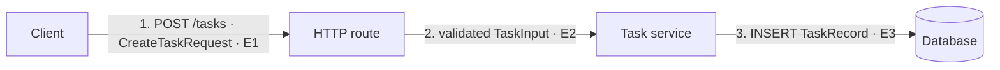

# Human-made system maps

Use this protocol when an active card asks the person to draw, revise, or explain a system map. The map is a learning artifact: it should expose the person's current model and make that model testable against repository evidence. It is not decorative architecture documentation and does not need to cover the whole repository.

Use the person's output language for titles, labels, explanations, table headings, and review feedback. Preserve code symbols, paths, payload names, identifiers, and machine-readable status values.

## Use the canonical form

The default form is a **numbered runtime flow map plus an evidence index**.

- Nodes represent runtime responsibilities such as a client, entrypoint, service, worker, queue, store, external system, or delivery system. Do not create one node per file or directory.
- Edges follow one concrete behavior and are numbered in causal order.
- Each material edge names an action and, when applicable, the payload, event, record, or artifact that crosses the boundary.
- Important state creation, transformation, persistence, and external effects are visible.
- Each material node and edge points to evidence or is explicitly marked `inferred` or `unknown`.
- One map covers one bounded vertical slice. Prefer a readable partial model over an unverified whole-repository diagram.

Mermaid `flowchart` is the recommended persistent format because its source is readable and versionable, but it is not required. Accept ASCII diagrams, whiteboards, paper sketches, diagramming-tool exports, or other forms that express the same model. When the diagram itself is not text-inspectable, require a textual node/edge description and evidence index so a later session can resume without relying on visual interpretation alone. Do not require the person to install a drawing tool.

Sequence diagrams, entity-relationship diagrams, and C4-style context or container diagrams may supplement the runtime flow map when timing, data structure, or system boundaries are the learning target. They do not replace the default flow map when the card is about tracing behavior across runtime boundaries.

## Run the drawing loop

Keep the person cognitively responsible for the model.

### 1. Prediction draft

Before giving the complete path, ask the person to draw their current prediction. Let them use `?`, incomplete nodes, and `unknown` edges. Give a concrete behavior to trace and enough of a starting point to avoid blind guessing, such as a visible behavior, one entrypoint, or one test. Do not prefill the final topology or all of its connections.

### 2. Evidence pass

Have the person inspect the repository and revise the draft. For each important node or edge, they should record:

- the runtime responsibility or action;
- what enters, leaves, or changes;
- a direct file-and-symbol reference, a focused `path:line` location, a test, or observed runtime output;
- `observed`, `inferred`, or `unknown` confidence.

`observed` means the cited code, test, configuration, or behavior directly supports the claim. `inferred` means evidence supports a conclusion without directly demonstrating it. `unknown` means the available evidence is insufficient. Do not invent numeric confidence scores.

### 3. Evidence review

Review the person's submitted map against the actual repository. Point out the smallest specific mismatch or missing boundary and let the person repair it when safe. Do not silently replace their map with an agent-authored answer.

If the person cannot start after orientation help, provide a blank diagram frame, candidate runtime-role categories, or the next single connection to investigate. If they explicitly ask the agent to draw the completed map, state the mode change, record the supplied model as learning debt, and plan a recovery exercise in which they reconstruct, modify, debug, or defend it.

### 4. Redraw and teach back

After the evidence-backed revision, ask the person to explain or redraw the slice without copying the artifact. They should be able to describe:

1. the trigger and entrypoint;
2. each important boundary in causal order;
3. the control, data, event, record, or artifact crossing each boundary;
4. where state is created, transformed, or persisted;
5. one realistic failure boundary or unresolved unknown;
6. which repository evidence would need rechecking after a relevant change.

Keep the card in `review` when the artifact is correct but the person cannot yet reconstruct or explain the target model. Use a focused retracing or variation exercise rather than asking them to memorize labels.

## Use this persistent template

When learning documents are being saved, use a focused file such as `docs/repo-ownership/maps/GMRB-002-create-task.md`. Adapt the headings and labels to the person's language.

````markdown
# System map: <bounded behavior>

- Repository revision: `<commit or other stable revision>`
- Working tree state: `<clean, or a non-secret summary of relevant local changes>`
- Evidence checked at: `<date or session>`
- Evidence validity: `current` or `needs_recheck`
- Target behavior: <one observable journey>
- Scope: <included vertical slice and deliberate exclusions>

## Prediction draft

<The person's first map or a link to it. Preserve uncertainty rather than rewriting history.>

## Evidence-backed revision



## Evidence index

| Evidence | Map claim | Repository evidence | Confidence |
| --- | --- | --- | --- |
| E1 | The route receives `POST /tasks`. | `src/routes/tasks.ts:20` | observed |
| E2 | The route passes validated input to the service. | `src/routes/tasks.ts:35` | observed |
| E3 | The service persists a task record. | `src/services/tasks.ts:42` | observed |

## Revisions after review

- <What changed in the model and which evidence caused the change>

## Remaining unknowns

- <Unknown, why it remains unknown, and what evidence could resolve it>

## Teach-back notes

- <The person's own explanation, failure boundary, and change-impact prediction>
````

The example illustrates the contract, not a required visual style. Simplify the artifact when a smaller map proves the learning objective.

## Review the map

Check the model, not its artistic quality:

- **Scope:** Does the map name one concrete behavior and avoid claiming complete-repository coverage without evidence?
- **Runtime roles:** Are nodes responsibilities that exist while the system runs, builds, or deploys rather than dressed-up directory names?
- **Causality:** Can the numbered edges be narrated from trigger to result without unexplained jumps?
- **Boundary semantics:** Does each important edge name a meaningful action and what crosses the boundary instead of saying only `uses` or `depends on`?
- **State:** Are creation, transformation, ownership, persistence, and external effects visible where relevant?
- **Evidence:** Does each cited location prove the adjacent claim? Are inference and uncertainty labeled honestly?
- **Currency:** Does the recorded repository revision still match the map's applicable path and inputs? If a material change affects them, has the previous map been preserved and marked `needs_recheck`?
- **Failure:** Can the person identify where one realistic failure would surface and how they would investigate it?
- **Ownership:** Can the person revise and explain the map without receiving a completed replacement from the agent?

Do not fail a map because it lacks a preferred renderer, color scheme, icon set, or visual polish. Split it when multiple unrelated journeys make the causal path hard to explain, and merge nodes when separate boxes represent one runtime responsibility merely because the code lives in different files.
